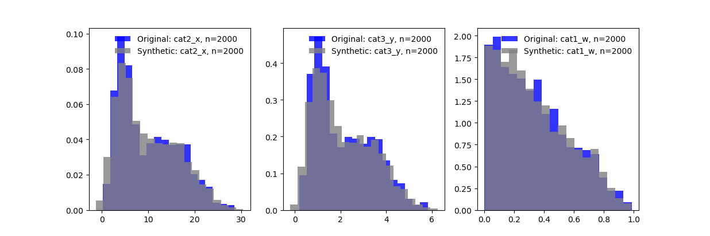
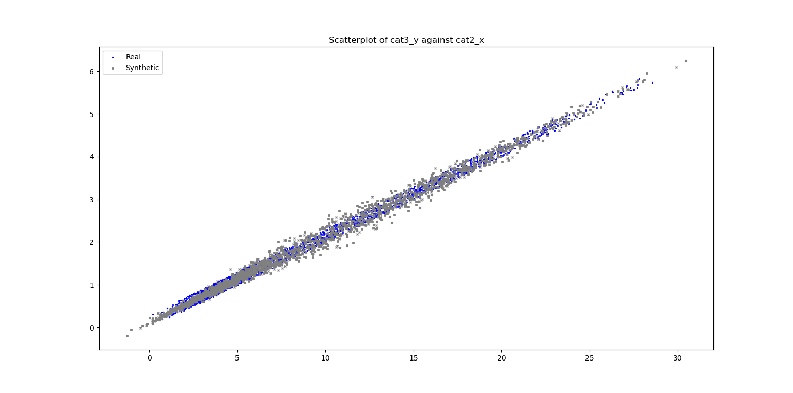
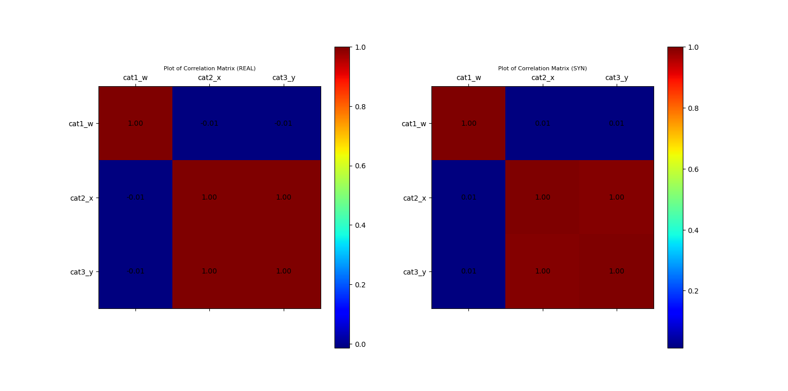

## Example of GaussianCopula Class
This example demonstrates the use of the GaussianCopula class to generate synthetic data for a multivariate dataset of some linearity.

### Import Libraries
```
# LOAD DEPENDENCIES
import pprint, sys, os
import matplotlib.pyplot as plt
import numpy as np
import pandas as pd
from scipy import stats

# Add path (if necessary)
dir_path = os.path.dirname(os.path.realpath(__file__))
par_dir = os.path.dirname(dir_path)
sys.path.insert(0, par_dir)

from bdarpack.MarginalDist import MarginalDist
from bdarpack.GaussianCopula import GaussianCopula
from bdarpack.Transformer import Transformer
from bdarpack import utils_ as ut_
```

### Generate random data
In this example, we are simulating a simple linear relationship between variables `x` and `y`, such that `y = 0.2x`, with uniform noise.
This implies that the theoretical correlation between `x` and `y` is `1`, and their sample correlation should be very close to `1`.
We also throw in a random variable `w`, of some Beta distribution. `w` is generated independently of `x` and `y`.

We build a generic function to generate some multivariate data.

```
def sample_multiple_corr(
            size=1000,
            seed=4,
            func1=None,
            func2=None,
            x1=None,
            x2=None
    ):

    def linear_func(x):
        return ut_.gen_linear_func(x, m=1, c=0, noise_factor=0)

    if func1 is None:
        func1 = linear_func
    if func2 is None:
        func2 = linear_func
    

    with ut_.random_seed(seed):
        # x1 = stats.norm.rvs(loc=0, scale=1, size=size)
        # x1 = stats.norm.rvs(loc=10, scale=2, size=size)

        if x1 is None:
            x1 = stats.norm.rvs(loc=0, scale=1, size=size)
        else:
            x1 = x1(size)

        if x2 is None:
            x2 = stats.norm.rvs(loc=0, scale=1, size=size)
        else:
            x2 = x2(size)
        
        # x2 = stats.norm.rvs(loc=10, scale=2, size=size)
        # x1 = stats.gamma.rvs(a=5, loc=0, scale=1, size=size)
        # x2 = stats.gamma.rvs(a=5, loc=0, scale=1, size=size)
        y1 = func1(x1) # y1 = x1 * 0.2 + 0.2
        y2 = func2(x2) # y2 = x2 * 0.1 - 0.3
        # z1 = np.random.choice(["1", "2"], size=size)
        # z2 = np.random.choice(["3", "5"], size=size)
        w = stats.beta.rvs(a=1, b=2, size=int(size*2))

    data = pd.DataFrame({
        'cat1_w': w,
        'cat2_x': np.concatenate((x1,x2)),
        'cat3_y': np.concatenate((y1,y2)),
        # 'cat4_z': np.concatenate((z1,z2)),
    })

    return data
```

We call the function `sample_multiple_corr` using the following inputs:

```
def linear_func1(x):
    return ut_.gen_linear_func(x, m=0.2, c=0, noise_factor=0.3)

def x1(size):
    return stats.gamma.rvs(a=5, loc=0, scale=1, size=size)

def x2(size):
    return stats.norm.rvs(loc=15, scale=5, size=size)

data_df = sample_multiple_corr(
    size = 1000, 
    seed = 3, 
    func1 = linear_func1, 
    func2 = linear_func1,
    x1 = x1,
    x2 = x2
)
```

### Fit the multivariate data using a Gaussian Copula

```
gaussian_copula = GaussianCopula(debug=True, correlation_method='kendall')
gaussian_copula.fit(data_df)
```

### Sample Output
From the debug output, we see that the simulated data fits none of the known parametric distribution, since it comprises of both a `Gamma` distribution and a `Normal` distribution. Instead, it was fitted with the `Gaussian_KDE`.

```
Fitting var: cat2_x
Fitting data with known parametric distributions...
Fitting data with beta:: kstat: 0.08625566083423458:: pvalue: 2.1444459149468223e-13
Fitting data with laplace:: kstat: 0.13086841826833986:: pvalue: 2.51271289344259e-30
Fitting data with loglaplace:: kstat: 0.09094332550131301:: pvalue: 7.621736893869741e-15
Fitting data with gamma:: kstat: 0.06903383644766103:: pvalue: 9.870248316569304e-09   
Fitting data with gaussian:: kstat: 0.12926624795255431:: pvalue: 1.349186913723636e-29
Fitting data with student_t:: kstat: 0.12922667033316265:: pvalue: 1.406007841037184e-29
Fitting data with uniform:: kstat: 0.24262346091040143:: pvalue: 3.9696214480772015e-104
No good distributions found, using non-parametric estimation...
Fitting data with gaussian_kde:: kstat: 0.03488425501886348:: pvalue: 0.01501752263100655
```


### Sample some synthetic multivariate data from the fitted Gaussian Copula
We now sample some synthetic multivariate data from the fitted Gaussian Copula.

```
syn_samples_df = gaussian_copula.sample(size=2000)
```

### Visualisation

```
from bdarpack import VIsualPlot as vp

# Plot Histogram of Data Sample
ax_hist_1, fig_histogram = vp.hist(data_df['cat2_x'], position=131, title='Histogram Plot', label=f"Original: cat2_x, n={len(data_df['cat2_x'])}")
ax_hist_2, fig_histogram = vp.hist(data_df['cat3_y'], fig=fig_histogram, position=132, title='Histogram Plot', label=f"Original: cat3_y, n={len(data_df['cat3_y'])}")
ax_hist_3, fig_histogram = vp.hist(data_df['cat1_w'], fig=fig_histogram, position=133, title='Histogram Plot', label=f"Original: cat1_w, n={len(data_df['cat1_w'])}")

# Plot Histogram of Synthetic Sample
ax_hist_1, fig_histogram = vp.hist(syn_samples_df['cat2_x'], ax= ax_hist_1, fig=fig_histogram, color='grey', title='Histogram Plot', label=f"Synthetic: cat2_x, n={len(syn_samples_df['cat2_x'])}")
ax_hist_2, fig_histogram = vp.hist(syn_samples_df['cat3_y'], fig=fig_histogram, ax= ax_hist_2, color='grey', title='Histogram Plot', label=f"Synthetic: cat3_y, n={len(syn_samples_df['cat3_y'])}")
ax_hist_3, fig_histogram = vp.hist(syn_samples_df['cat1_w'], fig=fig_histogram, ax= ax_hist_3, color='grey', title='Histogram Plot', label=f"Synthetic: cat1_w, n={len(syn_samples_df['cat1_w'])}")

ax_hist_1.legend(loc='best', frameon=False)
ax_hist_2.legend(loc='best', frameon=False)
ax_hist_3.legend(loc='best', frameon=False)

# Build Correlation Plots
fig_corr = plt.figure()
ax_corr_1, fig_corr = vp.corrMatrix(data_df, fig=fig_corr, position=121, title='Plot of Correlation Matrix (REAL)')
ax_corr_2, fig_corr = vp.corrMatrix(syn_samples_df, fig=fig_corr, position=122, title='Plot of Correlation Matrix (SYN)')

# Build Scatterplots
fig_scatter = plt.figure()
ax_scatter, fig_scatter = vp.scatterPlot(data_df['cat2_x'], data_df['cat3_y'], label="Real", fig=fig_scatter, title=f"Scatterplot of cat3_y against cat2_x", color='blue', marker='.')
ax_scatter, fig_scatter = vp.scatterPlot(syn_samples_df['cat2_x'], syn_samples_df['cat3_y'], label="Synthetic", fig=fig_scatter, ax=ax_scatter, color='grey', marker='x')

plt.show()
```

### Sample Output

#### Plot of Histograms of both Original and Synthetic Data


#### Plot of Scatterplot of Original and Synthetic Data


#### Plot of Correlation Matrix of Original and Synthetic Data
