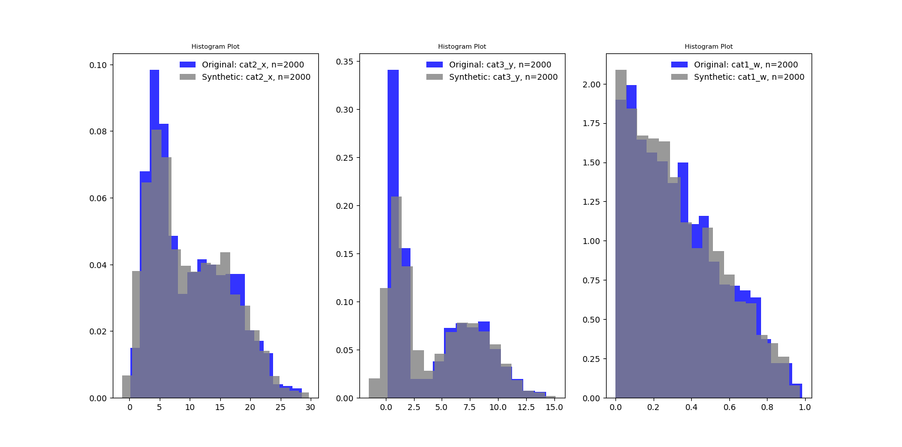
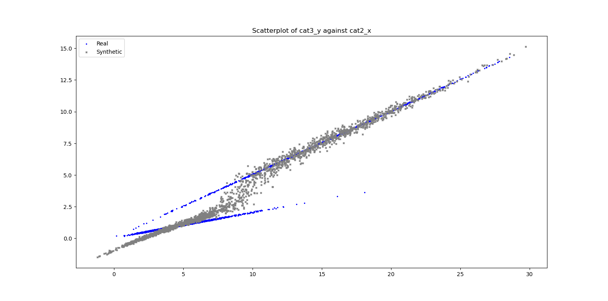
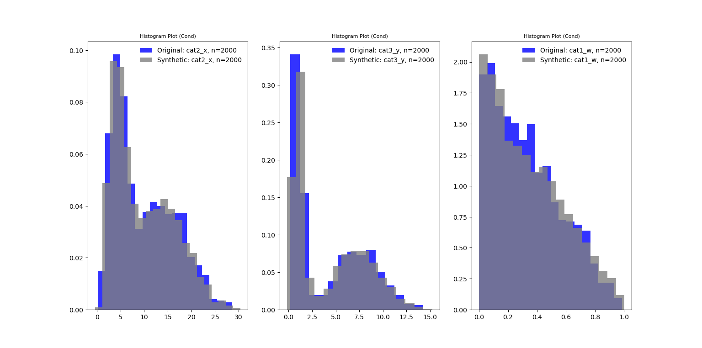
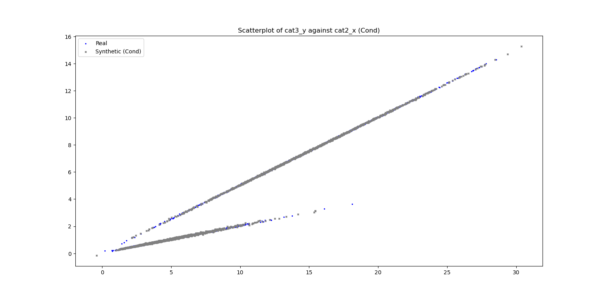
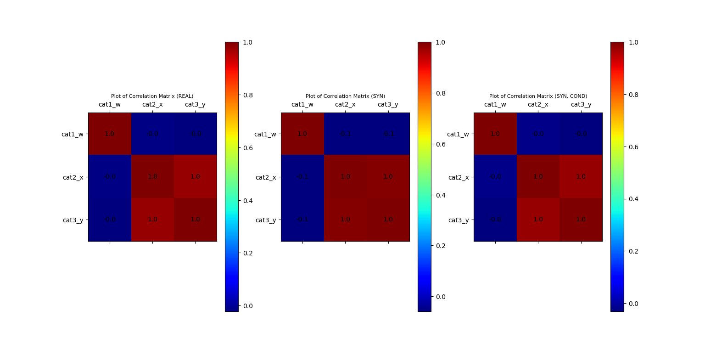

### Example of TabulaCopula Class
This example demonstrates the use of the TabulaCopula class to generate synthetic data for a multivariate dataset.

### Import Libraries
```
import sys, os
import matplotlib.pyplot as plt
import pandas as pd

# Add path (if necessary)
dir_path = os.path.dirname(os.path.realpath(__file__))
par_dir = os.path.dirname(dir_path)
sys.path.insert(0, par_dir)

from mz.TabulaCopula import TabulaCopula
from mz import utils_ as ut_
```

### Generate a 'fictional' data sample
In the first Gaussian copula example, we simulated a simple linear relationship between variables `x` and `y`, such that `y = 0.2x`, with uniform noise. 
This implies that the theoretical correlation between `x` and `y` is `1`, and their sample correlation should be very close to `1`.
We also threw in a random variable `w`, of some Beta distribution. `w` is generated independently of `x` and `y`.

In this example, we will modify the data slightly to target the insufficiencies of the Gaussian Copula.
To do so, we modified the simple linear relationship between variables `x` and `y`, such that `y=0.2x` for half of the data points (Set A), and `y=0.5x` for the other half (Set B), both of which has uniform noise. In this way, the theoretical correlation between `x` and `y` remains 1, and their sample correlation should stay very close to 1. However, the linear regression 'slope' between `x` and `y` ought to be different for sets A and B.
This simulation replicates the scenario where two population groups demonstrate distinct distributions for a common variable, which in turn interacts differently with a second variable.
We will use the categorical variable `cat4_z` to denote Set A as `1` and Set B as `3`.

Note that one can simply split the dataset into two distinct sets and learn separate copulas for each, then resample from the individual copulas based on whatever joint probability distribution one prefers. In the TabulaCopula implementation, the aforementioned joint probability distribution is the copula learned from the combined dataset.

```
def linear_func1(x): # Function to generate Set A
    return ut_.gen_linear_func(x, m=0.2, c=0, noise_factor=0.1)

def linear_func2(x): # Function to generate Set B
        return ut_.gen_linear_func(x, m=0.5, c=0, noise_factor=0.1)

def sample_multiple_corr(
            size=1000,
            seed=4,
            func1=linear_func1,
            func2=linear_func2
    ):
        from scipy import stats
        import numpy as np

        with ut_.random_seed(seed):
            x1 = stats.gamma.rvs(a=5, loc=0, scale=1, size=size)
            x2 = stats.norm.rvs(loc=15, scale=5, size=size)
            y1 = func1(x1) # y1 = x1 * 0.2 + 0
            y2 = func2(x2) # y2 = x2 * 0.5 + 0
            z1 = np.random.choice(["1"], size=size)
            z2 = np.random.choice(["3"], size=size)
            w = stats.beta.rvs(a=1, b=2, size=int(size*2))

        data = pd.DataFrame({
            'cat1_w': w,
            'cat2_x': np.concatenate((x1,x2)),
            'cat3_y': np.concatenate((y1,y2)),
            'cat4_z': np.concatenate((z1,z2)),
        })

        return data

data_df = sample_multiple_corr(size=1000, seed=3)
```

### Build Data Dictionary for Data
The TabulaCopula class is a wrapper for building conditional copulas, built upon the foundations of the CleanData, Transformer, and GaussianCopula class. It makes use of the data-dictionary, which is a pre-requisite for the CleanData class. Since the data is self-generated, we have to build a data-dictionary before we can proceed.

```
data_dict_df = ut_.build_basic_data_dictionary(varList=list(data_df.columns), category="independent variable")
ut_.update_dataframe_rows(data_dict_df, refCol="NAME", listRows=['cat3_y'], col="CATEGORY", val="dependent variable")
ut_.update_dataframe_rows(data_dict_df, refCol="NAME", listRows=['cat3_y'], col="SECONDARY", val="Y")
ut_.update_dataframe_rows(data_dict_df, refCol="NAME", listRows=['cat4_z'], col="TYPE", val="string")
ut_.update_dataframe_rows(data_dict_df, refCol="NAME", listRows=['cat4_z'], col="CODINGS", val="1; 3")
```

#### Sample data dictionary
```
     NAME               DESCRIPTION     TYPE CODINGS              CATEGORY  COLUMN_NUMBER SECONDARY CONSTRAINTS
0  cat1_w  No description available  numeric          independent variable              1
1  cat2_x  No description available  numeric          independent variable              2
2  cat3_y  No description available  numeric            dependent variable              3         Y
3  cat4_z  No description available   string    1; 3  independent variable              4
```

### Save data to file
We save the generated data in the trainData folder.

```
# save generated data
data_df_filePath = f"{dir_path}\\trainData\\simulation_2_m=02_m=05.csv"
ut_.save_df_as_csv(data_df, filename=data_df_filePath, index=False)

dict_df_filePath = f"{dir_path}\\trainData\\simulation_2_m=02_m=05_dict.xlsx"
ut_.save_df_as_excel(data_dict_df, excel_file_name=dict_df_filePath, sheet_name="Sheet1", index=False)
```

### Initialise the TabulaCopula class with definitions
With our datasets in place, we can now initialise the TabulaCopula class.
To begin, we will need a definitions script to set all our global variables (ref definitions_tc_sim_2.py).

```
import definitions_tc_sim_2 as defi
```

Next, we define the conditional settings of our copula model.

```
conditionalSettings_dict = {
    "set_1": {
        "bool": True, #whether to use this condition or not
        "parent_conditions": { #dict setting parent conditions (can have more than one parent)
            "cat4_z": { #parent variable
                "condition": "set", #'set' or 'range'
                "condition_value": {#values to split sets. In this example, the parent variable is split into 2 sets, "1" and "3".
                    1: ["1"], 
                    2: ["3"]
                }
            }
        },
        "conditions_var": 0.5, #can be a list of covariates, or a float (correlation threshold)
        "children": "allOthers" #or list of children ['cat1_w', 'cat2_x', 'cat3_y']
    }
}
```

Initialise the TabulaCopula class
```
tc = TabulaCopula(
    definitions=defi, 
    conditionalSettings_dict=conditionalSettings_dict,
    metaData_transformer=None #optional input to determine how to transform the inputs into numerical equivalents (see Transformer class)
)
```

### Generate Synthetic Data using (Gaussian) copula (without conditional settings)
```
tc.syn_generate(cond_bool=False)
```

### Visualisation of Results
```
from mz import VIsualPlot as vp
data_df = tc.train_df
syn_samples_df = tc.reversed_df

# Plot Histogram of Data Sample
ax_hist_1, fig_histogram = vp.hist(data_df['cat2_x'], position=131, title='Histogram Plot', label=f"Original: cat2_x, n={len(data_df['cat2_x'])}")
ax_hist_2, fig_histogram = vp.hist(data_df['cat3_y'], fig=fig_histogram, position=132, title='Histogram Plot', label=f"Original: cat3_y, n={len(data_df['cat3_y'])}")
ax_hist_3, fig_histogram = vp.hist(data_df['cat1_w'], fig=fig_histogram, position=133, title='Histogram Plot', label=f"Original: cat1_w, n={len(data_df['cat1_w'])}")

# Plot histogram of synthetic sample
ax_hist_1, fig_histogram = vp.hist(syn_samples_df['cat2_x'], ax= ax_hist_1, fig=fig_histogram, color='grey', title='Histogram Plot', label=f"Synthetic: cat2_x, n={len(syn_samples_df['cat2_x'])}")
ax_hist_2, fig_histogram = vp.hist(syn_samples_df['cat3_y'], fig=fig_histogram, ax= ax_hist_2, color='grey', title='Histogram Plot', label=f"Synthetic: cat3_y, n={len(syn_samples_df['cat3_y'])}")
ax_hist_3, fig_histogram = vp.hist(syn_samples_df['cat1_w'], fig=fig_histogram, ax= ax_hist_3, color='grey', title='Histogram Plot', label=f"Synthetic: cat1_w, n={len(syn_samples_df['cat1_w'])}")

# Plot Scatter
fig_scatter = plt.figure()
ax_scatter, fig_scatter = vp.scatterPlot(data_df['cat2_x'], data_df['cat3_y'], label="Real", fig=fig_scatter, color='blue', marker='.')
ax_scatter, fig_scatter = vp.scatterPlot(syn_samples_df['cat2_x'], syn_samples_df['cat3_y'], label="Synthetic", fig=fig_scatter, ax=ax_scatter, color='grey', marker='x', title=f"Scatterplot of cat3_y against cat2_x")
```

### Sample Output

#### Plot of Histograms of both Original and Synthetic Data


#### Plot of Scatterplot of Original and Synthetic Data


### Generate Synthetic Data using (Gaussian) copula (with conditional settings)
```
tc.syn_generate(cond_bool=True)
```

### Visualisation of Results
```
syn_samples_conditional_df = tc.reversed_conditional_df

# Plot Histogram of Data Sample
ax_hist_4, fig_histogram_cond = vp.hist(data_df['cat2_x'], position=131, title='Histogram Plot', label=f"Original: cat2_x, n={len(data_df['cat2_x'])}")
ax_hist_5, fig_histogram_cond = vp.hist(data_df['cat3_y'], fig=fig_histogram_cond, position=132, title='Histogram Plot', label=f"Original: cat3_y, n={len(data_df['cat3_y'])}")
ax_hist_6, fig_histogram_cond = vp.hist(data_df['cat1_w'], fig=fig_histogram_cond, position=133, title='Histogram Plot', label=f"Original: cat1_w, n={len(data_df['cat1_w'])}")

# Plot histogram of synthetic sample (conditional)
ax_hist_4, fig_histogram_cond = vp.hist(syn_samples_conditional_df['cat2_x'], ax= ax_hist_4, fig=fig_histogram_cond, color='grey', title='Histogram Plot (Cond)', label=f"Synthetic: cat2_x, n={len(syn_samples_conditional_df['cat2_x'])}")
ax_hist_5, fig_histogram_cond = vp.hist(syn_samples_conditional_df['cat3_y'], fig=fig_histogram_cond, ax= ax_hist_5, color='grey', title='Histogram Plot (Cond)', label=f"Synthetic: cat3_y, n={len(syn_samples_conditional_df['cat3_y'])}")
ax_hist_6, fig_histogram_cond = vp.hist(syn_samples_conditional_df['cat1_w'], fig=fig_histogram_cond, ax= ax_hist_6, color='grey', title='Histogram Plot (Cond)', label=f"Synthetic: cat1_w, n={len(syn_samples_conditional_df['cat1_w'])}")

# Build Correlation Plots
fig_corr = plt.figure()
ax_corr_1, fig_corr = vp.corrMatrix(data_df, fig=fig_corr, position=131, title='Plot of Correlation Matrix (REAL)')
ax_corr_2, fig_corr = vp.corrMatrix(syn_samples_df, fig=fig_corr, position=132, title='Plot of Correlation Matrix (SYN)')
ax_corr_3, fig_corr = vp.corrMatrix(syn_samples_conditional_df, fig=fig_corr, position=133, title='Plot of Correlation Matrix (SYN, COND)')

# Plot Scatter
fig_scatter_cond = plt.figure()
ax_scatter_cond, fig_scatter_cond = vp.scatterPlot(data_df['cat2_x'], data_df['cat3_y'], label="Real", fig=fig_scatter_cond, color='blue', marker='.')
ax_scatter_cond, fig_scatter_cond = vp.scatterPlot(syn_samples_conditional_df['cat2_x'], syn_samples_conditional_df['cat3_y'], label="Synthetic (Cond)", fig=fig_scatter_cond, ax=ax_scatter_cond, color='grey', marker='x', title=f"Scatterplot of cat3_y against cat2_x (Cond)")

plt.show()
```

### Sample Output
#### Plot of Histograms of both Original and Synthetic Data (conditional)


#### Plot of Scatterplot of Original and Synthetic Data (conditional)


#### Plot of Correlation Matrix of Original and Synthetic Data (normal + conditional)



### Save instance for future use
Instance will be saved as a pickle file, along with a dictionary of output filenames.
```
tc.save()
```

#### Sample Output
```
Saving class instance to filename: *\synData\simulation_2_m=02_m=05--CL.pkl
Saving class instance complete.
Saving output filenames to csv: *\synData\simulation_2_m=02_m=05--CL-OF.csv
Saving output filenames complete.
```