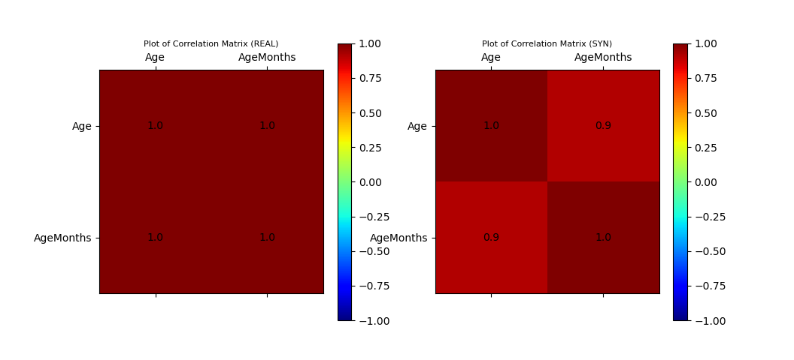

### Example of TabulaCopula Class
This example demonstrates the use of the TabulaCopula class to generate synthetic data for a multivariate real dataset (NHANES), between variables of known linear relationship.

Added complications:
*   the dataset has a large number of N.A. values

From the data dictionary, we understand that the `AgeMonths` variable has the following characteristics:
*   If 'SurveyYr' = '2009_10' and 'Age'>=80, 'AgeMonths' = (blanks)
*   If 'SurveyYr' = '2011_12' and 'Age'>=3, 'AgeMonths' = (blanks)
*   If 'SurveyYr' = '2011_12' and 'AgeMonths'>=24, 'AgeMonths' = (blanks)

As seen from above, `AgeMonths` is dependent on the values of `SurveyYr` and `Age`, and it makes sense to model the conditional probability distribution of `AgeMonths`, given `SurveyYr` and `Age`.
Should we choose to ignore the conditional distributions, we may continue to model the joint distribution of `SurveyYr`, `Age`, and `AgeMonths`, simply by treating the N.A. values as missing values. In this scenario, we should be aware of two issues:
*   we may not replace missing values with `mean`/`mode` options, as this will distort the marginal distribution of `AgeMonths`. The best option in this case is to use the `ignore` option, which uses as many data-points as possible, ignoring missing values only when necessary.
*   we may also remove all the rows with N.A. values prior to transformation. This probably works best, provided there are enough rows left after the filtering.

There are two useful applications for synthetic data in this experiment:
*   Replicating the original data as it is; that is fulfilling its listed characteristics above. This is hard to reproduce without exerting external constraints, if conditional-copula, or the option where null values are removed prior to transformation, was not adopted. 
*   Inputing AgeMonths values for 'SurveyYr' = '2009_10' and 'Age'>=80, AND 'SurveyYr' = '2011_12' and 'Age'>=3. (yet to be implemented)

### Import Libraries
```
# LOAD DEPENDENCIES
import pprint, sys, os
import matplotlib.pyplot as plt
import pandas as pd

# Add path (if necessary)
dir_path = os.path.dirname(os.path.realpath(__file__))
par_dir = os.path.dirname(dir_path)
sys.path.insert(0, par_dir)

from mz.TabulaCopula import TabulaCopula

# LOAD DEFINITIONS
import definitions_nhanes_1 as defi
```

### Load script containing definitions
The definitions.py is where most, if not all, of the global attributes in the tabular-copula pipeline are defined. It contains the paths, filenames, prefixes, and options to the inputs and outputs of the pipeline.

Refer to the sample definitions_nhanes_1.py provided for detailed guidance on individual attributes.

```
import definitions_nhanes_1 as defi
```

### Initialise the TabulaCopula class with definitions
With the loaded definitions, we can initialise our TabulaCopula class. Prior to that, we can define a few other settings.

Since we only wish to examine three variables `SurveyYr`, `Age`, and `AgeMonths`, we can set the `var_list_filter` option to a list of these three variables:
```
var_list = ['SurveyYr', 'Age', 'AgeMonths']
```

Additionally, if we wish to remove all the null values in the dataset prior to transformation, we may set the `removeNull` option to `True`. We will only show the results for the `False` option in this example (to experiment, simply set the option to `True` instead).

Like before, we can the transformation of the variables to numerical equivalents of our liking using a `meteData_transformer` dict.

```
metaData_transformer = {
    'SurveyYr':{
        'null': "N.A.",
        'transformer_type': 'One-Hot' # or 'LabelEncoding'
    },
    'Age':{'null': 'ignore'},
    'AgeMonths':{'null': 'ignore'} #AgeMonths have large numbers of missing values. Using 'mean'/'mode' options is not recommended as the imputed values will distort the marginal distribution.
}
```

If we are not using the conditional-copula setup, we can ignore the `conditionalSettings_dict` option, or set it to `None`
```
conditionalSettings_dict = None
```

We are now ready to initialise our `TabulaCopula` class:
```
tc = TabulaCopula(
    definitions = defi,
    output_general_prefix = output_general_prefix,
    var_list_filter = var_list,
    metaData_transformer = metaData_transformer,
    conditionalSettings_dict = conditionalSettings_dict,
    removeNull = False, #when False, will NOT remove null values prior to transformation
    debug = True
)
```

### Generation Synthetic Data (without conditional-copula option)
And generate synthetic data:
```
tc.syn_generate(cond_bool=False)
```

### Visualisation of Results
```
from mz import VIsualPlot as vp

data_df_filename = f"{dir_path}/synData/nhanes_raw-DD-CON-ST-{output_general_prefix}-CURATED.csv"
syn_samples_df_filename = f"{dir_path}/synData/nhanes_raw-DD-CON-ST-{output_general_prefix}-REV.csv"

data_df = pd.read_csv(data_df_filename)
syn_samples_df = pd.read_csv(syn_samples_df_filename)

# Plot Correlation Plots
ax_corr_1, ax_corr_2, fig_corr = vp.corrMatrix_compare(data_df, syn_samples_df)

# Plot Histogram of Data Sample
ax_hist, fig_histogram = vp.hist_compare(data_df, syn_samples_df, var_list=var_list, no_cols=3)

# Plot Scatter
data_df_surveyYr_2009_10 = data_df[data_df['SurveyYr']=='2009_10']
data_df_surveyYr_2011_12 = data_df[data_df['SurveyYr']=='2011_12']
syn_samples_df_surveyYr_2009_10 = syn_samples_df[syn_samples_df['SurveyYr']=='2009_10']
syn_samples_df_surveyYr_2011_12 = syn_samples_df[syn_samples_df['SurveyYr']=='2011_12']

ax_scatter, fig_scatter = vp.scatterPlot(data_df_surveyYr_2009_10['Age'], data_df_surveyYr_2009_10['AgeMonths'], fig=plt.figure(), color='blue', marker='.', label='Real (2009_10)')
ax_scatter, fig_scatter = vp.scatterPlot(data_df_surveyYr_2011_12['Age'], data_df_surveyYr_2011_12['AgeMonths'], fig=fig_scatter, ax=ax_scatter, color='red', marker='.', label='Real (2011_12)')

ax_scatter, fig_scatter = vp.scatterPlot(syn_samples_df_surveyYr_2009_10['Age'], syn_samples_df_surveyYr_2009_10['AgeMonths'], fig=fig_scatter, ax=ax_scatter, color='grey', marker='x', label='Syn (2009_10)')
ax_scatter, fig_scatter = vp.scatterPlot(syn_samples_df_surveyYr_2011_12['Age'], syn_samples_df_surveyYr_2011_12['AgeMonths'], fig=fig_scatter, ax=ax_scatter, color='black', marker='x', label='Syn (2011_12)')

plt.show()
```

### Sample Output

#### Plot of Histograms of both Original and Synthetic Data


#### Plot of Scatterplot of Original and Synthetic Data


#### Plot of Correlation Matrix of Original and Synthetic Data


### Initialise the TabulaCopula class with definitions
We may repeat the above setup, but this time with an additional conditional-copula element. To do so, we modify the `conditionalSettings_dict` option.

Since there is only one "round" of conditioning, we label this "round" as `set_1`. There are 2 `parents` involved: `SurveyYr` and `Age`, both of which are split into sets based on what we know from the data dictionary.
```
conditionalSettings_dict = {
    "set_1": {
        "bool": True,
        "parent_conditions": { # 2 parents
            "SurveyYr": { # split variable into 2 sets
                "condition": "set",
                "condition_value": {
                    1: ["2009_10"],
                    2: ["2011_12"]
                }
            },
            "Age": { # split variable into 3 sets based on range
                "condition": "range",
                "condition_value": {
                    1: [">=3", "<79"],
                    2: ["<3"],
                    3: [">=79"]
                }
            }
        },
        "conditions_var": ["Age"],
        "children": ['AgeMonths']
    }
}
```

We are now ready to initialise our `TabulaCopula` class:
```
tc = TabulaCopula(
    definitions = defi,
    output_general_prefix = output_general_prefix,
    var_list_filter = var_list,
    metaData_transformer = metaData_transformer,
    conditionalSettings_dict = conditionalSettings_dict,
    removeNull = False, #when False, will NOT remove null values prior to transformation
    debug = True
)
```

### Generation Synthetic Data (without conditional-copula option)
And generate synthetic data:
```
tc.syn_generate(cond_bool=True)
```

Note that `tc.syn_generate` is a wrapper for the following snippet:
```
tc.transform()
if cond_bool:
    tc.transform_conditional()
    
tc.fit_gaussian_copula()
if cond_bool:
    tc.fit_gaussian_copula_conditional()

tc.sample_gaussian_copula(sample_size=2000)
if cond_bool:
    tc.sample_gaussian_copula_conditional()

tc.reverse_transform()
```

At times, it may be useful to run these steps individually.

For debugging purposes, it is also useful to glean certain details of the learned copula, which we may extract using:
```
tc.print_details_copula()
```

### Visualisation of Results
```
from mz import VIsualPlot as vp

data_df_filename = f"{dir_path}/synData/nhanes_raw-DD-CON-ST-{output_general_prefix}-CURATED.csv"
syn_samples_conditional_df_filename = f"{dir_path}/synData/nhanes_raw-DD-CON-ST-{output_general_prefix}-COND_REV.csv"

data_df = pd.read_csv(data_df_filename)
syn_samples_conditional_df = pd.read_csv(syn_samples_conditional_df_filename)

# Plot Correlation Plots
ax_corr_cond_1, ax_corr_cond_2, fig_cond_corr = vp.corrMatrix_compare(data_df, syn_samples_conditional_df)

# Plot Histogram of Data Sample
ax_cond_hist, fig_cond_histogram = vp.hist_compare(data_df, syn_samples_conditional_df, var_list=var_list, no_cols=3)

# Plot Scatter
data_df_surveyYr_2009_10 = data_df[data_df['SurveyYr']=='2009_10']
data_df_surveyYr_2011_12 = data_df[data_df['SurveyYr']=='2011_12']
syn_samples_conditional_df_surveyYr_2009_10 = syn_samples_conditional_df[syn_samples_conditional_df['SurveyYr']=='2009_10']
syn_samples_conditional_df_surveyYr_2011_12 = syn_samples_conditional_df[syn_samples_conditional_df['SurveyYr']=='2011_12']

ax_scatter_cond, fig_scatter_cond = vp.scatterPlot(data_df_surveyYr_2009_10['Age'], data_df_surveyYr_2009_10['AgeMonths'], fig=plt.figure(), color='blue', marker='.', label='Real (2009_10)')
ax_scatter_cond, fig_scatter_cond = vp.scatterPlot(data_df_surveyYr_2011_12['Age'], data_df_surveyYr_2011_12['AgeMonths'], fig=fig_scatter_cond, ax=ax_scatter_cond, color='red', marker='.', label='Real (2011_12)')

ax_scatter_cond, fig_scatter_cond = vp.scatterPlot(syn_samples_conditional_df_surveyYr_2009_10['Age'], syn_samples_conditional_df_surveyYr_2009_10['AgeMonths'], fig=fig_scatter_cond, ax=ax_scatter_cond, color='grey', marker='x', label='Syn-Cond (2009_10)')
ax_scatter_cond, fig_scatter_cond = vp.scatterPlot(syn_samples_conditional_df_surveyYr_2011_12['Age'], syn_samples_conditional_df_surveyYr_2011_12['AgeMonths'], fig=fig_scatter_cond, ax=ax_scatter_cond, color='black', marker='x', label='Syn-Cond (2011_12)')

plt.show()
```

### Sample Output

#### Plot of Histograms of both Original and Synthetic Data


#### Plot of Scatterplot of Original and Synthetic Data


#### Plot of Correlation Matrix of Original and Synthetic Data
