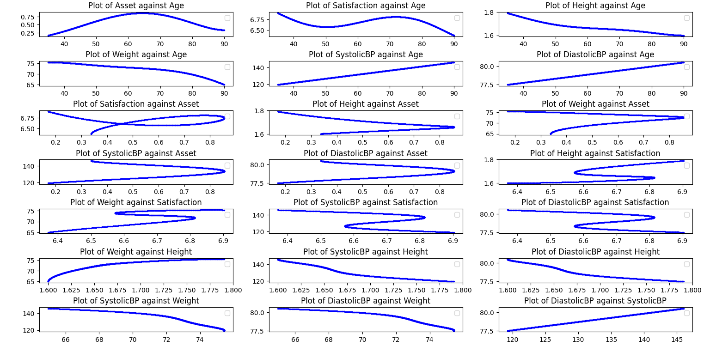
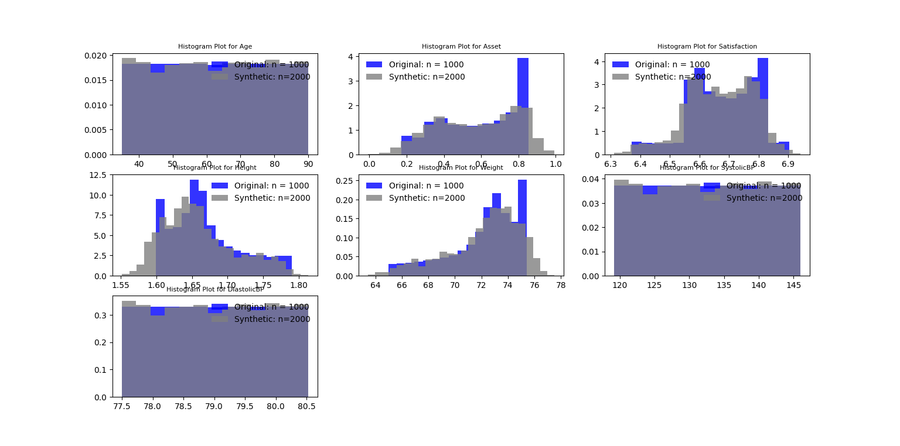
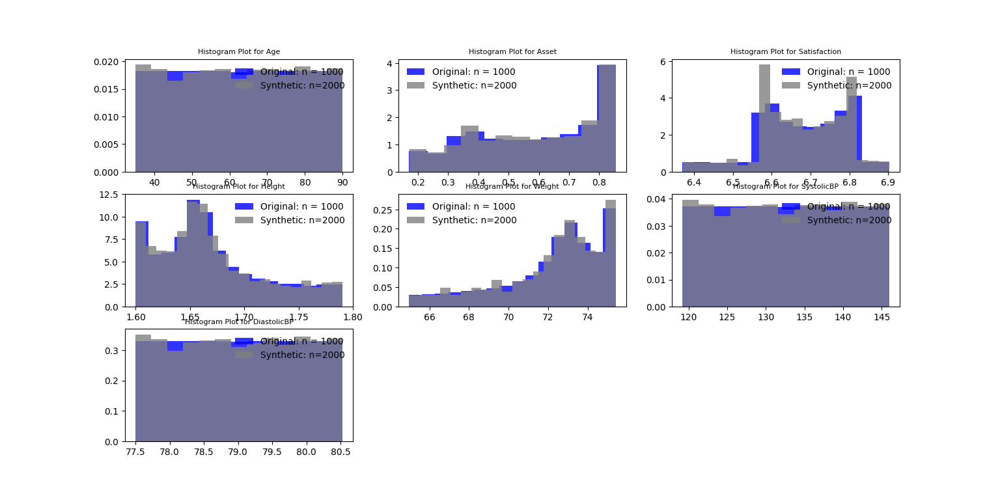
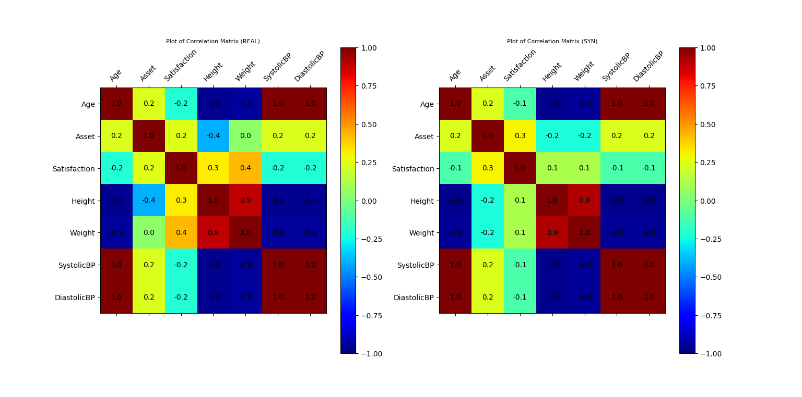
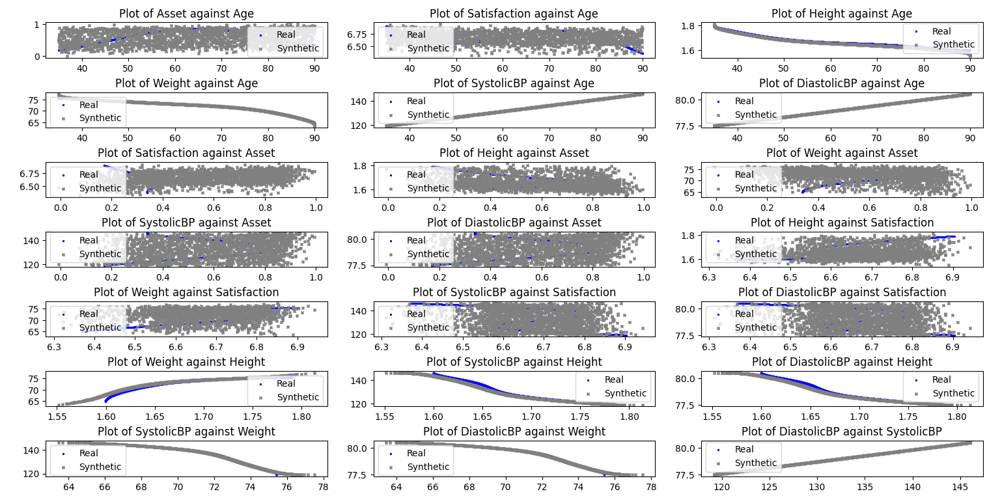
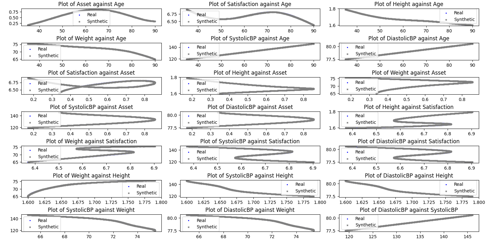

### Example of TabulaCopula Class
This example demonstrates the use of the TabulaCopula class to generate synthetic data for a multivariate simulated dataset (socialdata), between variables of known non-linear, non-monotonic relationships.

The dataset contains 7 simulated variables with the following relationships:
#### Plot of all relationships between 7 simulated variables


### Import Libraries
```
import sys, os
import matplotlib.pyplot as plt
import pickle

# ADD PATH  (if necessary)
dir_path = os.path.dirname(os.path.realpath(__file__))
par_dir = os.path.dirname(dir_path)
sys.path.insert(0, par_dir)
head, sep, tail = dir_path.partition('copula-tabular')
sys.path.insert(0, head+sep) # adding par_dir to system path

from bdarpack.TabulaCopula import TabulaCopula
from bdarpack import VIsualPlot as vp
from bdarpack import utils_ as ut_
```

### Load script containing definitions
The definitions.py is where most, if not all, of the global attributes in the tabular-copula pipeline are defined. It contains the paths, filenames, prefixes, and options to the inputs and outputs of the pipeline.

Refer to the sample definitions_script_3.py provided for detailed guidance on individual attributes.

```
import definitions_script_3 as defi
```

### Initialise the TabulaCopula class with definitions
With the loaded definitions, we can initialise our TabulaCopula class. Prior to that, we can define a few other settings.

Like before, we can initiate the transformation of the variables to numerical equivalents of our liking using a `meteData_transformer` dict. This step is relatively simple (i.e. can be ignored) for this dataset because all the variables are already numeric. There are also no `null` variables.

```
metaData_transformer = None
```

If we are not using the conditional-copula setup, we can ignore the `conditionalSettings_dict` option, or set it to `None`. We set a flag so that we can turn this option `on` and `off` easily. 

For convenience, we set three flags, namely `run_syn`, `cond_bool`, and `visual`, to run the synthetic data generation algorithm, use conditional settings, and plot results, respectively. It is not necessary to run the algorithm everytime just to plot results, or perform privacy leakage tests on the generated data, since we can easily save it in a pickle file for future use.

```
run_syn = True
cond_bool = True
visual = True
output_general_prefix = 'TC3-C' # to label different runs
```

We set three different sets of conditions, and will be running them in sequence, on top of a set of baseline synthetic data, generated without conditions. 
The first set `set_1-0` is equivalent to a baseline set where the `Age` variable is split into intervals of `10` years each. Essentially, we will be splitting the dataset into different subject groups and learning their joint distributions `P_i(X,Y)` separately, before re-sampling the `children` variables `(X)` based on the new joint distributions, conditional on `conditions_var` variables `(Y)`, i.e. `P_i(X|Y)`.

The second `set_1-1` and third `set_1-2` set of conditions are targeted at `Asset` and `Satisfaction`, which are the non-monotonic variables w.r.t. `Age`. The same reasoning applies, but with finer groupings of the underlying `Age` variable.
```
if cond_bool:
    # LOAD CONDITIONAL SETTINGS
    conditionalSettings_dict = {
        "set_1-0": {
            "bool": True,
            "parent_conditions": {
                "Age":{
                    "condition": "range",
                    "condition_value": ut_.gen_dict_range_interval(interval=10, min_num=30, max_num=90)
                }
            },
            "conditions_var": ["Age"],
            "children": "allOthers"
        },
        "set_1-1": {
            "bool": True,
            "parent_conditions": {
                "Age":{
                    "condition": "range",
                    "condition_value": ut_.gen_dict_range_interval(interval=5, min_num=30, max_num=90)
                }
            },
            "conditions_var": ["Age"],
            "children": ["Asset"]
        },
        "set_1-2": {
            "bool": True,
            "parent_conditions": {
                "Age":{
                    "condition": "range",
                    "condition_value": {
                        1: [">=30", "<40"],
                        2: [">=40", "<50"],
                        3: [">=50", "<53"],
                        4: [">=53", "<73"],
                        5: [">=73", "<90"],
                    }
                }
            },
            "conditions_var": ["Age"],
            "children": ["Satisfaction"]
        }
    }
else:
    conditionalSettings_dict = None
```

We are now ready to initialise our `TabulaCopula` class:
```
tc = TabulaCopula(
    definitions = defi,
    output_general_prefix=output_general_prefix,
    conditionalSettings_dict = conditionalSettings_dict,
    metaData_transformer = metaData_transformer,
    debug=True
)
```

### Generation Synthetic Data (without conditional-copula option)
And generate synthetic data:
```
tc.syn_generate(cond_bool=cond_bool)
tc.save()
```

### Visualisation of Results
```
if visual_bool:
    if not syn_data_bool: #Load saved TC

        tc_filename = f"{dir_path}/synData/socialdata-{output_general_prefix}-CL.pkl"
        with open(tc_filename, 'rb') as fl:
            tc = pickle.load(fl)

    data_df = tc.train_df
    syn_samples_df = tc.reversed_df
    syn_samples_conditional_df = tc.reversed_conditional_df
    var_list = list(data_df.columns)

    # Plot Histogram of Data Sample
    if cond_bool:
        ax_hist, fig_histogram = vp.hist_compare(data_df, syn_samples_df, var_list=var_list, no_cols=3)
        ax_cond_hist, fig_cond_histogram = vp.hist_compare(data_df, syn_samples_conditional_df, var_list=var_list, no_cols=3)
    else:
        ax_hist, fig_histogram = vp.hist_compare(data_df, syn_samples_df, var_list=var_list, no_cols=2)

    # Plot Correlation Plots
    corr_options = {
        "x_label_rot": 45
    }
    ax_corr_1, ax_corr_2, fig_corr = vp.corrMatrix_compare(data_df, syn_samples_df, options=corr_options)
    if cond_bool:
        ax_corr_cond_1, ax_corr_cond_2, fig_cond_corr = vp.corrMatrix_compare(data_df, syn_samples_conditional_df, options=corr_options)

    # ScatterPlot
    ax_scatter, fig_scatter = vp.scatterPlot_multiple_compare(data_df, syn_samples_df, n_plot_cols=3, ref='autopermute')
    
    if cond_bool:
        ax_scatter_cond, fig_scatter_cond = vp.scatterPlot_multiple_compare(data_df, syn_samples_conditional_df, n_plot_cols=3, ref='autopermute')

    plt.show()
```

### Sample Output

#### Plot of Histograms of both Original and Synthetic Data


#### Plot of Histograms of both Original and Synthetic Data (conditional)


#### Plot of Correlation Matrix of Original and Synthetic Data


#### Plot of Correlation Matrix of Original and Synthetic Data (conditional)


#### Plot of Scatterplot of Original and Synthetic Data


#### Plot of Scatterplot of Original and Synthetic Data (conditional)
