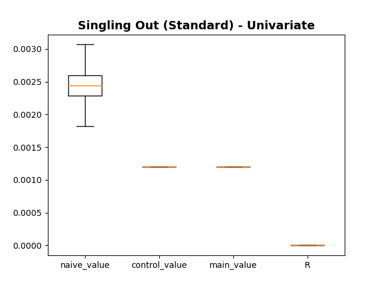

### Example of TabulaCopula Class
This example demonstrates the use of the TabulaCopula class to quantitatively assess the privacy leakage risks of generated synthetic data. We reuse the synthetic data generated from the [example](TabulaCopula_conditional).

One important pre-requisite of running the Privacy Leakage assessment is the approportion of control data prior to synthetic data generation. This step is automatically done in the TabulaCopula setup, by the `SAMPLING' variable in the definitions script (Under SETTINGS FOR PRIVACY LEAKAGE TESTING). If this value is set to '1', no control data will be available for Privacy Leakage assessments, and the TC class will not be able to build the Privacy Leakage evaluator.

### Import Libraries
```
import sys, os
import matplotlib.pyplot as plt

# Add path (if necessary)
dir_path = os.path.dirname(os.path.realpath(__file__))
par_dir = os.path.dirname(dir_path)
sys.path.insert(0, par_dir)

from bdarpack.TabulaCopula import load_TC
```

### Load Script Containing Definitions
Since we are continuing the example from [before](TabulaCopula_conditional), we will use the same definitions script.
```
import definitions_tc_sim_2 as defi #this is the same definitions script as the one used in 'eg_TabulaCopula_1.py'
```

### Load saved TabulaCopula instance
Load the saved TabulaCopula instance in the [example](TabulaCopula_conditional).
```
tc = load_TC(defi)
```

### Set flags for type of Privacy Leakage Test to conduct
```
singlingOut_uni = defi.SINGLINGOUT_UNI
singlingOut_multi = defi.SINGLINGOUT_MULTI
Linkability = defi.LINKABILITY
Inference = defi.INFERENCE
```

### Build the Privacy Metric Evaluators
In this step, we build a Privacy Metric Evaluator for both conditional/standard copulas. For more information on what is a Privacy Metric Evaluator, refer to Anonymeter [link](https://github.com/statice/anonymeter).
```
tc.build_privacyMetric()
privacyMetric_standard = tc.privacyMetricEval #built evaluator for standard copula
privacyMetric_conditional = tc.privacyMetricEval_cond #built evaluator for conditional copula
```

### (Optional) Set the number of iterations (for Batch Process)
This step is optional as the number of iterations is already defined in the definitions script. However, one may choose to overwrite the settings in the definitions script by deciding on a new value.
```
n = 4 #to overwrite the PRIVACY_BATCH_N value in definitions
```

### Running Various Privacy Leakage Attacks
In this step, we run the various privacy leakage attacks on both conditional/standard synthetic data. Results will be saved in the privacyMetrics folder (or any other folder as specified in definitions, under 'PRIV_PATH')

#### Singling Out Attack
We run the SinglingOut attack `n=4` times and plot the results in a box plot. The plot shows the spread of the 'Naive', 'Control', 'Main', and Risk Leakage (`R`) values for either the conditional/standard synthetic data. 

Generally, the 'Main'/'Control' attacks reflect the utility of the synthetic data in capturing 'training'/'population' level trends respectively. The difference between the two attacks is the Risk Leakage `R`.
```
if singlingOut_uni:
    # Run the singlingOut attack 'n' times (for standard copula)
    result_df = tc.privacyMetric_singlingOut_Batch(n=n, mode='univariate', n_attacks='auto', print_results=True)

    # Plot Box-Plot of Results (standard)
    fig_uni, ax_uni = privacyMetric_standard.plot_risk_results(result_df, plot_title=f'Singling Out (Standard) - Univariate')

    # Run the singlingOut attack 'n' times (for conditional copula)
    result_cond_df = tc.privacyMetric_singlingOut_cond_Batch(n=n, mode='univariate', n_attacks='auto', print_results=True)
                                                             
    # Plot Box-Plot of Results (conditional)
    fig_uni_cond, ax_uni_cond = privacyMetric_conditional.plot_risk_results(result_cond_df, plot_title=f'Singling Out (Conditional) - Univariate')
```

#### Boxplot (SinglingOut, Standard)


#### Boxplot (SinglingOut, Conditional)


#### Linkability Attack
We run the Linkability attack `n=4` times and plot the results in a box plot. The plot shows the spread of the 'Naive', 'Control', 'Main', and Risk Leakage (`R`) values for either the conditional/standard synthetic data. 

Generally, the 'Main'/'Control' attacks reflect the utility of the synthetic data in capturing 'training'/'population' level trends respectively. The difference between the two attacks is the Risk Leakage `R`.
```
if Linkability:

    # Set linkability attack settings (see Anonymeter for details)
    n_neighbors = 10
    aux_cols = [
        ['cat1_w', 'cat2_x', 'cat4_z'],
        ['cat3_y']
    ]

    # Run the linkability attack 'n' times (for standard copula)
    link_result_df = tc.privacyMetric_Linkability_Batch(aux_cols=aux_cols, n_neighbors=n_neighbors, n=n)

    # Plot Box-Plot of Results (standard)
    fig_link, ax_link = privacyMetric_standard.plot_risk_results(link_result_df, plot_title="Linkability (Standard)")

    # Run the linkability attack 'n' times (for conditional copula)
    link_cond_result_df = tc.privacyBatch_Linkability_cond_Batch(aux_cols=aux_cols, n_neighbors=n_neighbors, n=n)

    # Plot Box-Plot of Results (conditional)
    fig_link_cond, ax_link_cond = privacyMetric_conditional.plot_risk_results(link_cond_result_df, plot_title='Linkability (Conditional)')
```

#### Boxplot (Linkability, Standard)


#### Boxplot (Linkability, Conditional)


#### Inference Attack
We run the Linkability attack `n=100` times and plot the results in a box plot. The plot shows the spread of the 'Naive', 'Control', 'Main', and Risk Leakage (`R`) values for either the conditional/standard synthetic data. We split the plots based on attacks; each plot shows the spread of a single attack across all variables.

Generally, the 'Main'/'Control' attacks reflect the utility of the synthetic data in capturing 'training'/'population' level trends respectively. The difference between the two attacks is the Risk Leakage `R`.

```
if Inference:

    # Run the inference attack 'n' times (for standard copula)
    res = tc.privacyMetric_Inference_Batch()
    print(res)

    # Plot Box-Plot of Results 'R' (standard)
    fig, ax = privacyMetric_standard.plot_inference_risk_results(res, res_col='R', plot_title='Inference Evaluator (R) (Standard)')

    # Plot Box-Plot of Results 'Naive Attack' (standard)
    fig_cv, ax_cv = privacyMetric_standard.plot_inference_risk_results(res, res_col='naive_value', plot_title='Inference Evaluator (Naive) (Standard)')

    # Plot Box-Plot of Results 'Control Attack' (standard)
    fig_cv, ax_cv = privacyMetric_standard.plot_inference_risk_results(res, res_col='control_value', plot_title='Inference Evaluator (Control) (Standard)')

    # Plot Box-Plot of Results 'Main Attack' (standard)
    fig_cv, ax_cv = privacyMetric_standard.plot_inference_risk_results(res, res_col='main_value', plot_title='Inference Evaluator (Main) (Standard)')

    # Run the inference attack 'n' times (for conditional copula)
    res_cond = tc.privacyMetric_Inference_cond_Batch()

    # Plot Box-Plot of Results 'R' (conditional)
    fig_cond, ax_cond = privacyMetric_conditional.plot_inference_risk_results(res_cond, res_col='R', plot_title='Inference Evaluator (R) (Conditional)')

    # Plot Box-Plot of Results 'Naive Attack' (conditional)
    fig_cv_cond, ax_cv_cond = privacyMetric_conditional.plot_inference_risk_results(res_cond, res_col='naive_value', plot_title='Inference Evaluator (Naive) (Conditional)')

    # Plot Box-Plot of Results 'Control Attack' (conditional)
    fig_cv_cond, ax_cv_cond = privacyMetric_conditional.plot_inference_risk_results(res_cond, res_col='control_value', plot_title='Inference Evaluator (Control) (Conditional)')

    # Plot Box-Plot of Results 'Main Attack' (conditional)
    fig_cv_cond, ax_cv_cond = privacyMetric_conditional.plot_inference_risk_results(res_cond, res_col='main_value', plot_title='Inference Evaluator (Main) (Conditional)')
```

#### Boxplot (Inference, Naive Attack, Standard)


#### Boxplot (Inference, Naive Attack, Conditional)


#### Boxplot (Inference, Control Attack, Standard)


#### Boxplot (Inference, Control Attack, Conditional)


#### Boxplot (Inference, Main Attack, Standard)


#### Boxplot (Inference, Main Attack, Conditional)


#### Boxplot (Inference, Risk Leakage, Standard)


#### Boxplot (Inference, Risk Leakage, Conditional)
