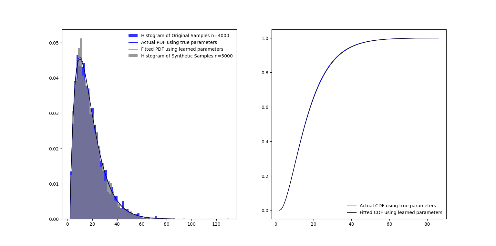
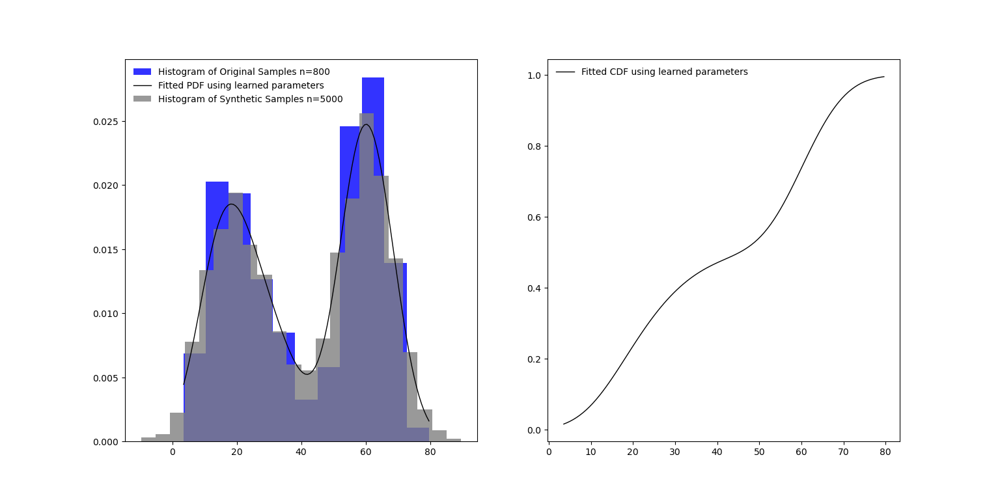

## Example of MarginalDist Class
This example demonstrates the use of the MarginalDist class to generate synthetic data for a univariate dataset.

### Import Libraries
```
# LOAD DEPENDENCIES
import pprint, sys, os
import matplotlib.pyplot as plt
import numpy as np

# Add path (if necessary)
dir_path = os.path.dirname(os.path.realpath(__file__))
par_dir = os.path.dirname(dir_path)
sys.path.insert(0, par_dir)

from bdarpack.MarginalDist import MarginalDist
from scipy import stats
```

### Build Plot Area
```
fig, (ax1, ax2) = plt.subplots(1,2)
```

### Generate random data
In this example, we use the scipy stats package to generate a fictitious sample, based on a gamma distribution.
```
# GENERATE A "FICTIONAL" DATA SAMPLE USING SCIPY
a = 2
loc = 2
scale = 8
samples = stats.gamma.rvs(a=a, loc=loc, scale=scale, size=4000)

# VISUALISE THEORETICAL PDF, CDF AND HISTOGRAM OF GENERATED DATA
# Plot Histogram of Data Sample
ax1.hist(samples, density=True, bins='auto', alpha=0.8, color='blue', label=f'Histogram of Original Samples n={(len(samples))}')

# Plot PDF of Data Sample
x = np.linspace(np.min(samples), np.max(samples), 100)
sample_pdf = stats.gamma.pdf(x=x, a=a, loc=loc, scale=scale)
ax1.plot(x, sample_pdf, 'b-', lw=1, label='Actual PDF using true parameters')

# Plot CDF of Data Sample
x = np.linspace(np.min(samples), np.max(samples), 100)
sample_cdf = stats.gamma.cdf(x=x, a=a, loc=loc, scale=scale)
ax2.plot(x, sample_cdf, 'b-', lw=1, label='Actual CDF using true parameters')
```

### Generate synthetic data
Next, we try to learn the underlying distribution of the generated data. Since the data only has one variable, the MarginalDist class is already sufficient.
```
# INITIALISE A MARGINALDIST CLASS
univariate = MarginalDist(debug=True)

# LEARN THE OPTIMAL DISTRIBUTION FROM THE DATA SAMPLES
univariate.fit(data=samples)
print(f"optimum univariate: {univariate.fitted_marginal_dist}")

# PLOT THE LEARNED PDF, CDF, AND HISTOGRAM OF SYNTHETIC SAMPLES
# Plot Learned CDF
x = np.linspace(np.min(samples), np.max(samples), 100)
learned_cdf = univariate.cdf_wrapper(data=x)
ax2.plot(x, learned_cdf, 'k-', lw=1, label='Fitted CDF using learned parameters')

# Plot Learned PDF
x = np.linspace(np.min(samples), np.max(samples), 100)
learned_pdf = univariate.pdf_wrapper(data=x)
ax1.plot(x, learned_pdf, 'k-', lw=1, label='Fitted PDF using learned parameters')

# Create a synthetic sample from learned parameters
x = stats.uniform.rvs(size=5000)
learned_ppf = univariate.ppf_wrapper(data=x)
ax1.hist(learned_ppf, density=True, bins='auto', alpha=0.8, color='gray', label=f"Histogram of Synthetic Samples n={len(learned_ppf)}")
```

### Sample Output
```
Fitting data with known parametric distributions...
Fitting data with beta:: kstat: 0.008172649641283392:: pvalue: 0.9500962142965577
Fitting data with laplace:: kstat: 0.10698355129539623:: pvalue: 2.53940293993326e-40
Fitting data with loglaplace:: kstat: 0.04875553618279055:: pvalue: 1.0570495250612113e-08
Fitting data with gamma:: kstat: 0.0076758003704006095:: pvalue: 0.9710713107419339
Fitting data with gaussian:: kstat: 0.09376866669868594:: pvalue: 4.645675962787757e-31
Fitting data with student_t:: kstat: 0.08774938698900313:: pvalue: 3.0109710266979776e-27
Fitting data with uniform:: kstat: 0.5327760567138355:: pvalue: 0.0
optimum univariate: gamma
Parameters used for generating CDF:/n {'df': 100, 'loc': 1.9389883076225938, 'scale': 8.112381524781696, 'a': 2.0005591824545768, 'b': 1, 'c': 1, 'ecdf': {}, 'gaussian_kde': {}}
Parameters used for generating PDF:/n {'df': 100, 'loc': 1.9389883076225938, 'scale': 8.112381524781696, 'a': 2.0005591824545768, 'b': 1, 'c': 1, 'ecdf': {}, 'gaussian_kde': {}}
Parameters used for generating PPF:/n {'df': 100, 'loc': 1.9389883076225938, 'scale': 8.112381524781696, 'a': 2.0005591824545768, 'b': 1, 'c': 1, 'ecdf': {}, 'gaussian_kde': {}}
```

### PLOT STUFF
```
ax1.legend(loc='best', frameon=False)
ax2.legend(loc='best', frameon=False)
plt.show()
```

### Plot of learned distribution and generated synthetic data samples


## Example 2 of MarginalDist Class
In this example, we demonstrate the use of the MarginalDist class to generate synthetic data for a univariate dataset, when the dataset does not follow a known distribution.

### Generate random data
In this example, we use the scipy stats package to generate a fictitious sample, based on a mixed gamma and Gaussian distribution.
```
# GENERATE A "FICTIONAL" DATA SAMPLE USING SCIPY
samples_1 = stats.gamma.rvs(a=4, loc=2, scale=5, size=400)
samples_2 = stats.norm.rvs(loc=60, scale=6, size=400)
samples = np.concatenate((samples_1, samples_2))
```

### Generate synthetic data
Next, we try to learn the underlying distribution of the generated data. Since the data only has one variable, the MarginalDist class is already sufficient.
```
# INITIALISE A MARGINALDIST CLASS
univariate = MarginalDist(debug=True)

# LEARN THE OPTIMAL DISTRIBUTION FROM THE DATA SAMPLES
univariate.fit(data=samples)
print(f"optimum univariate: {univariate.fitted_marginal_dist}")

# PLOT THE LEARNED PDF, CDF, AND HISTOGRAM OF SYNTHETIC SAMPLES
# Plot Learned CDF
x = np.linspace(np.min(samples), np.max(samples), 100)
learned_cdf = univariate.cdf_wrapper(data=x)
ax2.plot(x, learned_cdf, 'k-', lw=1, label='Fitted CDF using learned parameters')

# Plot Learned PDF
x = np.linspace(np.min(samples), np.max(samples), 100)
learned_pdf = univariate.pdf_wrapper(data=x)
ax1.plot(x, learned_pdf, 'k-', lw=1, label='Fitted PDF using learned parameters')

# Create a synthetic sample from learned parameters
x = stats.uniform.rvs(size=5000)
learned_ppf = univariate.ppf_wrapper(data=x)
ax1.hist(learned_ppf, density=True, bins='auto', alpha=0.8, color='gray', label=f"Histogram of Synthetic Samples n={len(learned_ppf)}")
```

### Sample Output
```
Fitting data with known parametric distributions...
Fitting data with beta:: kstat: 0.15218241984053915:: pvalue: 1.2146709184078006e-16
Fitting data with laplace:: kstat: 0.2016538619963058:: pvalue: 5.400890340048729e-29
Fitting data with loglaplace:: kstat: 0.23085243173668069:: pvalue: 5.761247455714581e-38
Fitting data with gamma:: kstat: 0.1739346795510226:: pvalue: 1.231265354302602e-21
Fitting data with gaussian:: kstat: 0.1706894482350294:: pvalue: 7.563699611893537e-21
Fitting data with student_t:: kstat: 0.17066442930791947:: pvalue: 7.669253557944495e-21
Fitting data with uniform:: kstat: 0.10784867680944032:: pvalue: 1.4745236262854905e-08
No good distributions found, using non-parametric estimation...
Fitting data with gaussian_kde:: kstat: 0.043047521739585815:: pvalue: 0.10015583588080923
optimum univariate: gaussian_kde
Parameters used for generating PDF:/n {'df': 100, 'loc': 0, 'scale': 0.2626527804403767, 'a': 1, 'b': 1, 'c': 1, 'ecdf': {}, 'gaussian_kde': {'x': array([-101.39095449, -101.38095449, -101.37095449, ...,  184.51904551,
        184.52904551,  184.53904551]), 'u': array([2.51191352e-85, 5.11203884e-85, 7.80346492e-85, ...,
       1.00000000e+00, 1.00000000e+00, 1.00000000e+00])}}
Parameters used for generating PDF:/n {'df': 100, 'loc': 0, 'scale': 0.2626527804403767, 'a': 1, 'b': 1, 'c': 1, 'ecdf': {}, 'gaussian_kde': {'x': array([-101.39095449, -101.38095449, -101.37095449, ...,  184.51904551,
        184.52904551,  184.53904551]), 'u': array([2.51191352e-85, 5.11203884e-85, 7.80346492e-85, ...,
       1.00000000e+00, 1.00000000e+00, 1.00000000e+00])}}
Parameters used for generating PDF:/n {'df': 100, 'loc': 0, 'scale': 0.2626527804403767, 'a': 1, 'b': 1, 'c': 1, 'ecdf': {}, 'gaussian_kde': {'x': array([-101.39095449, -101.38095449, -101.37095449, ...,  184.51904551,
        184.52904551,  184.53904551]), 'u': array([2.51191352e-85, 5.11203884e-85, 7.80346492e-85, ...,
       1.00000000e+00, 1.00000000e+00, 1.00000000e+00])}}
```

### PLOT STUFF
```
ax1.legend(loc='best', frameon=False)
ax2.legend(loc='best', frameon=False)
plt.show()
```

### Plot of learned distribution and generated synthetic data samples
