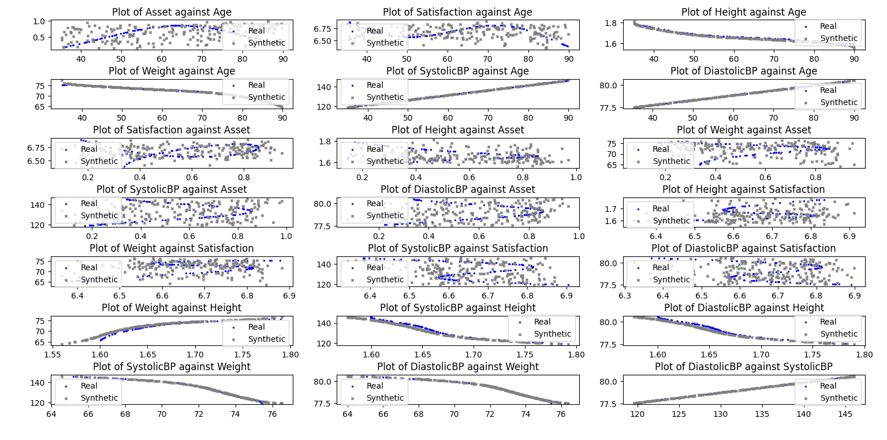
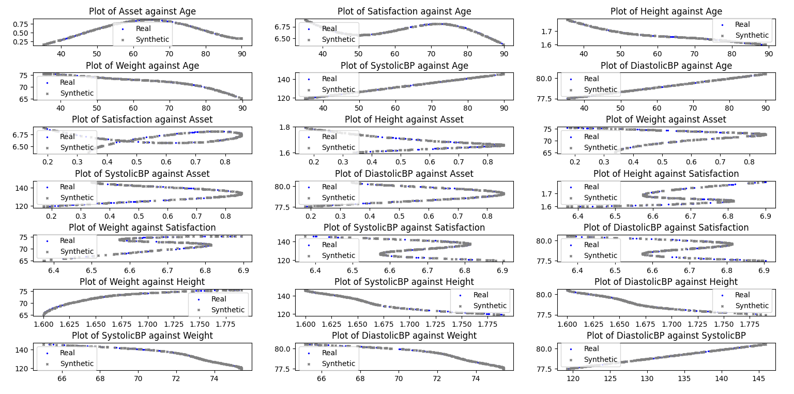

# Summary

<!-- The forces on stars, galaxies, and dark matter under external gravitational
fields lead to the dynamical evolution of structures in the universe. The orbits
of these bodies are therefore key to understanding the formation, history, and
future state of galaxies. The field of "galactic dynamics," which aims to model
the gravitating components of galaxies to study their structure and evolution,
is now well-established, commonly taught, and frequently used in astronomy.
Aside from toy problems and demonstrations, the majority of problems require
efficient numerical tools, many of which require the same base code (e.g., for
performing numerical orbit integration). -->
Recent advancements in synthetic data generation have made it a viable solution for applications in various fields, such as finance, biomedical research [@dahmen2019synsys], and data science[@raghunathan2021synthetic]. Synthetic data is generated artificially, yet replicates the joint probability distribution of its real-world counterpart. Its ability to mimic the statistical behaviour of real data makes it a useful tool for testing algorithms, systems, and training machine learning models, and it can be used as an economical substitute for real data when it is not available, is too sensitive to release, or too costly to acquire. Copula-based data generation methods [@li2014differentially;@li2020sync;kamthe2021copula;@patki2016synthetic] have been demonstrated to produce reliable and accurate tabular data when generating synthetic data.

# Statement of need

In this software, we present an improved version of the copula tools as seen in Synthetic Data Vault (SDV) [@patki2016synthetic], a widely used tool for generating multivariate synthetic data through Gaussian copulas. This enhanced model incorporates conditional joint distributions into its framework, allowing for the splitting of single variables into multiple component marginal distributions. The improved version of the SDV provides greater usability in the synthesis of complex, non-linear, non-monotonic sample distributions (see Fig.\autoref{fig:example}), and stronger replication of correlation between variables (see Fig. \autoref{fig:correlationplots}), allowing for the replication of a wider range of tabular datasets.

Our enhancement is written entirely in Python, builds on the existing infrastructure of SDV, and is designed to work with a data dictionary specifying the metadata of the input dataset. There are additional class-based implementations of data cleaning, visualisation tools, transformation tools, privacy leakage evaluation, and sample wrapper scripts for generating synthetic data from start to finish.

<!-- `Gala` is an Astropy-affiliated Python package for galactic dynamics. Python
enables wrapping low-level languages (e.g., C) for speed without losing
flexibility or ease-of-use in the user-interface. The API for `Gala` was
designed to provide a class-based and user-friendly interface to fast (C or
Cython-optimized) implementations of common operations such as gravitational
potential and force evaluation, orbit integration, dynamical transformations,
and chaos indicators for nonlinear dynamics. `Gala` also relies heavily on and
interfaces well with the implementations of physical units and astronomical
coordinate systems in the `Astropy` package [@astropy] (`astropy.units` and
`astropy.coordinates`).

`Gala` was designed to be used by both astronomical researchers and by
students in courses on gravitational dynamics or astronomy. It has already been
used in a number of scientific publications [@Pearson:2017] and has also been
used in graduate courses on Galactic dynamics to, e.g., provide interactive
visualizations of textbook material [@Binney:2008]. The combination of speed,
design, and support for Astropy functionality in `Gala` will enable exciting
scientific explorations of forthcoming data releases from the *Gaia* mission
[@gaia] by students and experts alike. -->

# Mathematics

Single dollars ($) are required for inline mathematics e.g. $f(x) = e^{\pi/x}$

Double dollars make self-standing equations:

$$\Theta(x) = \left\{\begin{array}{l}
0\textrm{ if } x < 0\cr
1\textrm{ else}
\end{array}\right.$$

You can also use plain \LaTeX for equations
\begin{equation}\label{eq:fourier}
\hat f(\omega) = \int_{-\infty}^{\infty} f(x) e^{i\omega x} dx
\end{equation}
and refer to \autoref{eq:fourier} from text.

<!-- # Citations

Citations to entries in paper.bib should be in
[rMarkdown](http://rmarkdown.rstudio.com/authoring_bibliographies_and_citations.html)
format.

If you want to cite a software repository URL (e.g. something on GitHub without a preferred
citation) then you can do it with the example BibTeX entry below for @fidgit.

For a quick reference, the following citation commands can be used:
- `@author:2001`  ->  "Author et al. (2001)"
- `[@author:2001]` -> "(Author et al., 2001)"
- `[@author1:2001; @author2:2001]` -> "(Author1 et al., 2001; Author2 et al., 2002)" -->

# Figures

![Fig. 1: Figure showing simulated plots of generated synthetic data over the original data, using standard copulas. []{label="fig:example"}](docs/assets/img/tabulaCopula_example_socialdata_scatterplot_lowsampling.png)

and referenced from text using \autoref{fig:example}.

<!-- Figure sizes can be customized by adding an optional second parameter:
{ width=20% } -->

<!-- # Acknowledgements -->

<!-- We acknowledge contributions from Brigitta Sipocz, Syrtis Major, and Semyeong
Oh, and support from Kathryn Johnston during the genesis of this project. -->

# References